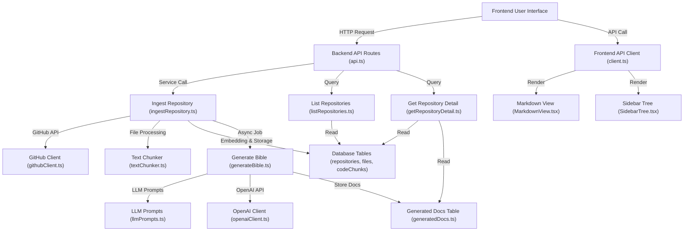

# Technical Architecture Document: Unheat/repo-bible

## Part 1: Architecture Summary

### 1. Project Purpose & Domain
This codebase is a **documentation generation and repository analysis tool**. It ingests code repositories (likely from GitHub), processes their content using LLMs (OpenAI), and generates structured documentation (a "bible"). The domain is developer tooling, specifically automated codebase documentation and knowledge management.

### 2. High-Level Architecture Pattern
The system follows a **layered monolithic architecture** with a clear separation between backend and frontend, and an event-driven ingestion pipeline.

**Evidence:**
- **Backend** (`backend/src/`): Contains services, routes, and database tables, indicating a service-layer pattern.
- **Frontend** (`frontend/src/`): A React application with pages and components, following a client-server model.
- **Event-driven elements**: Services like `ingestRepository.ts` and `generateBible.ts` suggest asynchronous processing pipelines for repository analysis and documentation generation.

### 3. Module Breakdown

**Backend (`backend/`):**
- `src/routes/api.ts`: Defines API endpoints (likely Express.js routes) for backend services.
- `src/server.ts`: Application entry point, likely setting up the HTTP server and middleware.
- `src/services/`: Core business logic modules:
  - `ingestRepository.ts`: Handles repository ingestion and processing.
  - `generateBible.ts`: Generates documentation from ingested data.
  - `listRepositories.ts`, `getRepositoryDetail.ts`, `deleteRepository.ts`, `openDocumentationPR.ts`: CRUD and operational operations for repositories.
- `src/tables/`: Database table definitions or data access layers for `codeChunks`, `files`, `generatedDocs`, and `repositories`.
- `src/lib/`: Utility libraries for file processing (`chunkAndEmbedFile.ts`, `textChunker.ts`), GitHub integration (`githubClient.ts`), LLM prompts (`llmPrompts.ts`), and OpenAI client (`openaiClient.ts`).
- `prisma/`: Database schema and configuration using Prisma ORM.

**Frontend (`frontend/`):**
- `src/App.tsx`: Root React component.
- `src/pages/`: Page components (`HomePage.tsx`, `RepoPage.tsx`).
- `src/components/`: Reusable UI components (`MarkdownView.tsx`, `SidebarTree.tsx`).
- `src/api/client.ts`: API client for backend communication.
- `src/utils/fileTree.ts`: Utility for handling file tree structures.

**Shared (`shared/`):**
- `types/api.ts`: TypeScript type definitions shared between frontend and backend for API contracts.

### 4. Data Flow
1. **Ingestion Flow**: A user initiates repository ingestion via the frontend. The request hits `backend/src/routes/api.ts`, which calls `services/ingestRepository.ts`. This service uses `lib/githubClient.ts` to fetch repository data, processes files with `lib/textChunker.ts` and `lib/chunkAndEmbedFile.ts`, and stores results in the database via `tables/` modules.
2. **Documentation Generation**: After ingestion, `services/generateBible.ts` is triggered (likely asynchronously). It uses `lib/llmPrompts.ts` and `lib/openaiClient.ts` to generate documentation, storing outputs in `tables/generatedDocs.ts`.
3. **Frontend Interaction**: The frontend (`frontend/src/api/client.ts`) communicates with backend APIs to list repositories, view details, and display generated documentation (`MarkdownView.tsx`).
4. **Database**: Prisma ORM (`backend/src/db/prisma.ts`) manages data flow between services and the database, with tables for repositories, files, code chunks, and generated docs.

### 5. Key Technical Dependencies
- **Backend**: `backend/package.json` likely includes Express, Prisma, OpenAI SDK, and GitHub SDK (inferred from `githubClient.ts` and `openaiClient.ts`).
- **Frontend**: `frontend/package.json` likely includes React, Vite, and TypeScript (inferred from `vite.config.ts` and `tsconfig.json`).
- **Shared**: `shared/types/api.ts` indicates a monorepo or shared library for type safety.
- **Database**: Prisma ORM is used (`backend/prisma/schema.prisma`, `backend/prisma.config.ts`).

### 6. Cross-Cutting Concerns
- **Authentication**: Not explicitly evident from the tree; likely handled via GitHub OAuth (inferred from `githubClient.ts`).
- **Logging**: Not explicitly evident; may be implemented in `server.ts` or services.
- **Configuration**: Environment variables via `.env.example` files in both backend and frontend.
- **Error Handling**: Likely centralized in `server.ts` or API routes; not explicitly detailed in the tree.
- **Type Safety**: Strongly enforced via TypeScript and shared types (`shared/types/api.ts`).

## Part 2: Mermaid Flowchart

